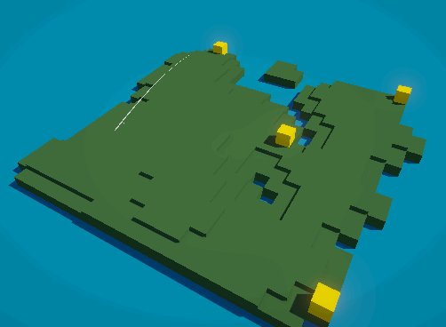

# Daily Golf Project
Unity example project demonstrating modular project architecture. A tiny golf game on a procedural map.

The goal of this game is to use data-oriented design patterns and modular coding patterns to allow the different systems to exist independently, and be built up over time.

## Game Architecture Patterns Being Used
- Data-Oriented Design. Primarily through storing game data in ScriptableObjets. See the [still-relevant 2017 Unite talk from Ryan Hipple](https://www.youtube.com/watch?v=raQ3iHhE_Kk).
- Actions. Using events ([static](https://guidebook.hdyar.com/docs/programming/advanced/static-objects-and-unity/) or on scriptableObjects) to decouple dependencies. See my [Event Systems in Unity](https://guidebook.hdyar.com/docs/programming/architecture/event-systems/) page.
- Extension Methods. Great for reusability, but also great for plain old readability. e.g. [self-documenting](https://en.wikipedia.org/wiki/Self-documenting_code) code.

## System Notes
### Golf Ball Movement
'Stroke' is a [POCO](https://en.wikipedia.org/wiki/Plain_old_CLR_object) that describes a single hit on the golf ball. It's used to store previous hits and edited at runtime. (Caddy scriptable object).CurrentStroke is what the trajectory prediction system is using to figure out what force might get added, for example.

## Scriptale Object Organization
"Active" scriptable objects (ActiveGolfConfiguration, InputReader) are objects used for storing references and accessing objects in the scene, instead of singletons, managers, or other such patterns to solve this problem. There is probably just one of these.

"Game Data" scriptable objects (Clubs), on the other hand, is just data. Settings, etc.

The Generator is a little of both. It's basically settings for generation, but it also stores a generation as an image texture sub asset.

### Input
Uses new input system. InputActins have a c# class generated, and interfacing with the input actions is done entirely by an InputReader scriptable object. The rest of the project only interfaces with this, which provides convenient actions, process functions, and read-only properties. It keeps the rest of the code agnostic of which input system we are using. It lets us send 'fake' inputs in a non-jank way easily, either with inspector scripts or with public functions. 

This technique is inspired from Unity's own '[modular game architecture with scriptableobjects](https://resources.unity.com/games/create-modular-game-architecture-with-scriptable-objects-ebook?ungated=true)' ebook ([repo](https://github.com/UnityTechnologies/PaddleGameSO)).

> Basically, the input reader serves the role of the [PlayerInput](https://docs.unity3d.com/Packages/com.unity.inputsystem@1.8/manual/PlayerInput.html) component.

Using a scriptableobject to "wrap" an inputactions has the further advantages.
- A convenient place to store input settings.
- A place to put custom inspector doodads to preview/read the data for debugging.
- A way to fire off test actions from the inspector.
- Easy handling of input state. We know there is a single source of truth for input (er, except for UI using the EventSystem).
- Hard to misconfigure - more of the setup is handled automatically. Compare with the 'universal' PlayerInput component.

Disadvantages
- It's overkill for this project.
  - a public reference to inputaction assets is certainly fine for a game of this scale.
  - We could do it the same, but provide the data as static actions and floats! I don't use statics because it lets me use multiple scriptable objects to store different settings instances for testing and swapping out easily. Especially useful for a project in source control.
- Another thing to remember and configure.
- When we create actions, we have to implement them in the ScriptableObject (since it's an interface for the binding), even ones we don't use.

Really, I just like this method for the sake of the rest of the code base. Doing a lot of XR development, it's always useful to have test buttons in the scene (although not needed for a project like this one). I like completely compartmentalizing input away - it tends to be a place where complexity grows over time, and lots of little input handling scripts has always been a headache.

### UI
HUD reads from the 'caddy'. With the scriptable object, it is completely independent from any other element.
in-scene UI is handled by the trajectory prediction system.

### Trajectory Prediction
Basically entirelly in a single script/child of the player, GolfHitPreviewLine.cs.

Uses [multi-scene physics](https://docs.unity3d.com/Manual/physics-multi-scene.html) to simulate the balls path and draw a line for each tick of that simulation. See the [TNTC](https://www.youtube.com/watch?v=4VUmhuhkELk) video for a breakdown of the technique.

### Camera Control
CameraSystem is a state machine. GolfCamera is the base class for a state. Actual camera switching is done via Cinemachine, changing the priority of the cameras, to use their blends.

I'm not very happy with the system right now, need to take advantage of cinemachine more - blending to a tee camera when the ball is close to a tee, blending to an overview when the ball is high; but using our own script for when aiming. The plan is some appropriate mix of high level custom state machine with lower level cinemachine.

### Custom Attributes
[ReadOnly] and [Layer] are not attributes that are built into Unity (although they should be).
I implemented these as custom attributes, see the utilities folder. Each one is in it's own folder/namespace because I imagine you may want to directly copy them into your own projects. Go for it. That's what I do.

### Map Generation
Map generation happens in a Generator scriptable Object (generator.cs). This creates a random level and saves it as a sub-asset, as a Texture2D. So anything can just read those files. We run a series of processes on the grid of pixels. See [This RedBlogGames](https://www.redblobgames.com/maps/terrain-from-noise/#islands) article for more information, and my own [2DRoguelikeLevelGenerator](https://github.com/hunterdyar/2DRougelikeLevelGenerator/) package.

Tee positions (and player spawn) are done by trying to randomly place non-overlapping circles onto the map on valid locations. We keep trying while decreasing the radius of the circle. It's poisson disk sampling with a search, and I would describe it as "good enough for now". It's slow and could have a tee spawn on an island of just one square.

MapGenerator.cs is a simple script to listen for generation (we can regenerate levels at runtime clicking a button in the inspector, very helpful for testing) that spawns in cubes on a grid.
